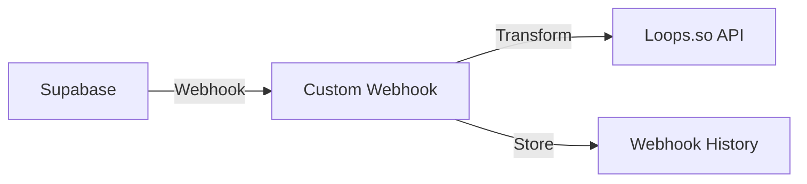

# Supabase to Loops.so Webhook Transformer

A Next.js serverless function that acts as a middleware to transform Supabase webhook payloads into Loops.so-compatible contact creation requests.


## 🌟 Overview

This project solves the limitation of direct Supabase-to-Loops.so integration by providing a custom webhook endpoint that:

1. Receives Supabase webhook payloads
2. Transforms the data into Loops.so's required format
3. Forwards the request to Loops.so's API
4. Maintains a history of processed webhooks for debugging



# 🚀 Getting Started

### Prerequisites
- Node.js 18+ installed
- A Supabase project
- A Loops.so account
- Vercel account (recommended for deployment)

### Environment Variables

Create a `.env.local` file with the following variables:
```
WEBHOOK_SECRET=your_webhook_secret
LOOPS_API_KEY=your_loops_api_key
```

### Installation

1. Clone the repository:

```bash
git clone https://github.com/yourusername/nextjs-loops-webhook
cd nextjs-loops-webhook
```

2. Install dependencies:
```bash
npm install
```

3. Run the development server:
```bash
npm run dev
```

## 🔧 Configuration

### 1. Loops.so Setup
1. Log in to your Loops.so account
2. Go to Settings → API
3. Copy your API key and add it to `.env.local`

### 2. Webhook Security
1. Generate a secure webhook secret:
```bash
openssl rand -base64 32
```
2. Add this secret to your `.env.local`

### 3. Supabase Setup
1. Go to your Supabase Dashboard
2. Navigate to Database → Database Webhooks
3. Create a new webhook with:
- URL: `https://your-domain.com/api/webhook/loops`
- HTTP Method: POST
- Headers: Add `X-Webhook-Secret` with your webhook secret
- Event Type: Based on your needs (e.g., INSERT, UPDATE)

## 📝 API Endpoints

### POST `/api/webhook/loops`
Receives webhook payloads from Supabase and forwards them to Loops.so.

**Headers Required:**
- `X-Webhook-Secret`: Your webhook secret

**Example Payload:**
```json
{
"record": {
"id": "123",
"email": "user@example.com",
"user_type": "customer"
    }
}
```

### GET `/api/webhook/loops`
Returns the history of processed webhooks for debugging purposes.

## 🔍 Debugging

The webhook maintains a history of recent requests that can be viewed by:
1. Making a GET request to `/api/webhook/loops`
2. Checking the response for both original and transformed payloads

## 🚀 Deployment

### Deploy to Vercel
1. Push your code to GitHub
2. Connect your repository to Vercel
3. Add environment variables in Vercel's dashboard
4. Deploy

## ⚠️ Limitations

- Webhook history is stored in memory and will be cleared on service restart
- Consider implementing persistent storage for production use

## 📄 License

MIT License - feel free to use this code in your projects.

## 🤝 Contributing

Contributions are welcome! Please feel free to submit a Pull Request.
